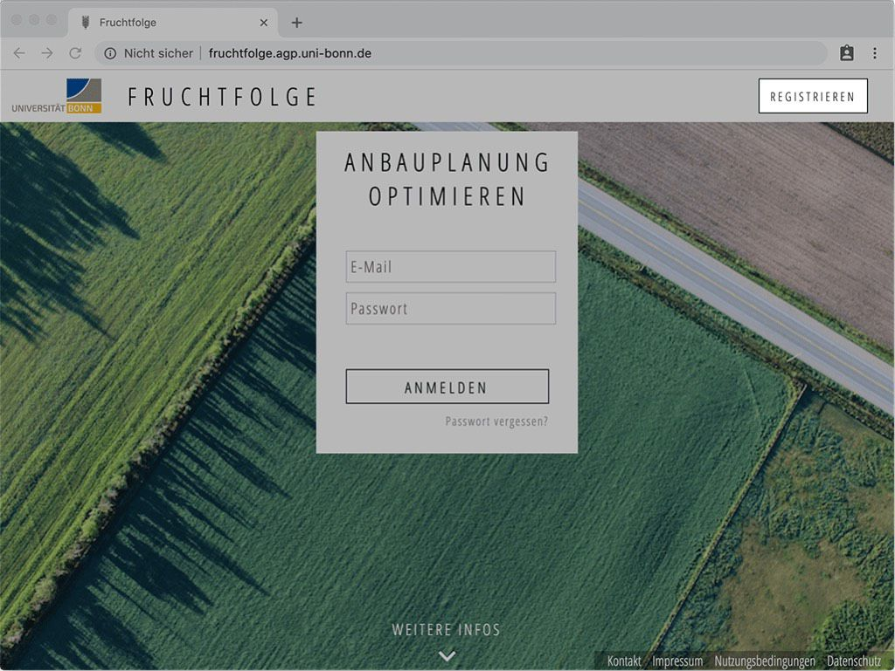
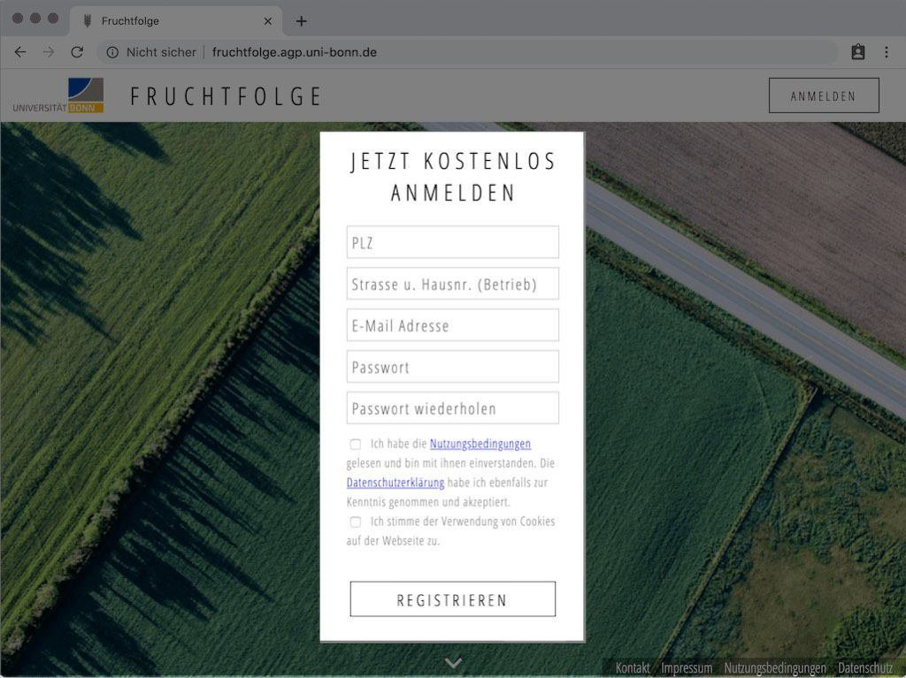

## Schön, dass Sie hier sind!
Willkommen auf der Support-Seite der Fruchtfolge Anwendung der Universität Bonn! 
Hier finden Sie ausführliche Anleitungen zu allen bestandteilen der Anwendung.
Bei offenen Fragen, Kritik und Anregungen können Sie uns gerne eine E-Mail schreiben an [fruchtfolge@uni-bonn.de](mailto:fruchtfolge@uni-bonn.de).

Sie wissen noch nicht, warum Sie die Fruchtfolge Anwendung benutzen sollten? Dann sehen Sie sich die [**Häufig gestellten Fragen**](./faq/faq.html#warum-sollte-ich-die-fruchtfolge-anwendung-benutzen) an.

<!--
::: tip Schulungsvideos
Die hier aufgeführten Informationen können Sie auch bequem [als Video ansehen](./videos/videos.html#registrieren).
:::
-->

## Registrieren
Um sich bei der Fruchtfolge Anwendung anmelden zu können, müssen Sie sich zunächst registrieren. Dazu öffnen Sie die Seite [fruchtfolge.uni-bonn.de](https://fruchtfolge.agp.uni-bonn.de) und klicken auf den 'Registrieren' Button in der oberen rechten Ecke der Seite.

::: tip Unterstütze Web-Browser
Die Fruchtfolge Anwendung wird laufend mit den aktuellsten Versionen der Browser [Google Chrome (empfohlen)](https://www.google.com/intl/de_de/chrome/), [Mozilla Firefox](https://www.mozilla.org/de/firefox/new/), [Microsoft Edge](https://www.microsoft.com/de-de/windows/microsoft-edge) und [Safari](https://www.apple.com/de/safari/) getestet. [**Microsoft Internet Explorer**](https://www.techbook.de/apps/software/microsoft-warnt-vor-ie) wird offiziell nicht unterstützt. Sollten bei der Benutzung der Anwendung fehler auftreten, überprüfen Sie bitte zunächst Ihren [Browser auf mögliche Updates](https://praxistipps.chip.de/browser-aktualisieren-so-gehts_10027). Falls die Fehler bestehen bleiben, wären wir über eine [kurze Mitteilung](mailto:fruchtfolge@uni-bonn.de) dankbar!
:::

Füllen Sie nun die Eingabefelder mit Ihren persönlichen Daten aus. 
Geben Sie in den Adressdatenfeldern (PLZ, Strasse und Hausnummer) bitte die **Adresse Ihres Hofes** (Betriebsstätte) an.

::: warning Wofür wird meine Adresse benötigt?
Bei der Optimierung der Fruchtfolge wird die Hof-Feld-Entfernung Ihrer Schläge berücksichtigt.
Diese wird zwischen dem jeweiligen Mittelpunkt des Schlags und Ihrer Hofadresse errechnet.
Nur so können Transportkosten und Arbeitszeiteffekte kultur- und schlagspezifisch abgebildet werden.
:::

Achten Sie zu Ihrer eigenen Sicherheit bei der Passwortvergabe darauf kein Passwort zu verwenden, dass Sie bereits anderweitig vergeben haben. Hinweise zur Erstellung besonders sicherer Passwörter bietet das [Bundesamt für Sicherheit in der Informationstechnologie](https://www.bsi-fuer-buerger.de/BSIFB/DE/Empfehlungen/Passwoerter/passwoerter_node.html).

Zuletzt müssen Sie noch den [Nutzungsbedingungen](https://fruchtfolge.agp.uni-bonn.de/nutzungsbedingungen), der [Datenschuterklärung](https://fruchtfolge.agp.uni-bonn.de/datenschutz) und der Verwendung von Cookies zustimmen. Klicken Sie anschließend auf den 'Registrieren' Button, um die Registierung abzuschließen.
