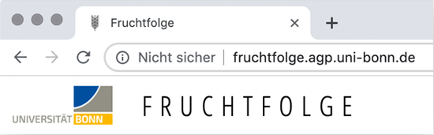

# Allgemein

## Die Webseite ist "Nicht sicher"
In Ihrem Browser wird neben der Adresse `fruchtfolge.uni-bonn.de` oder 
`fruchtfolge.agp.uni-bonn.de` folgendes angezeigt:

Dieser Hinweis tritt auf, da die Fruchtfolge Anwendung derzeit noch kein sog. `TLS` (Transport Layer Security, häufig auch `SSL` genannt) Zertifikat besitzt. `TLS` ist ein Verschlüsselungsprotokoll, dass beispielsweise die Kommunikation zwischen einem PC und einem Webserver absichert. Sie erkennen dieses in der Regel dadurch, dass die Adresse einer Website (`URL`) mit `https://` anstelle von `http://` beginnt. Ohne dieses Zertifikat ist es Angreifern potenziell möglich, Daten die zwischen einem PC und einem Server ausgetauscht werden (z.B. Benutzernamen und Passwörter) auszulesen, da diese nicht verschlüsselt sind.

Für die Fruchtfolge Anwendung wurde ein solches `TSL` Zertifikat beantragt. 
Sobald die Antragstellung abgeschlossen ist, wird die Fruchtfolge Anwendung auf `TSL` umgestellt werden.

Neben den aufgeführten Sicherheitskriterien wird der Funktionsumfang der Anwendung jedoch nicht beeinträchtigt.
In jedem Fall wird empfohlen kein Passwort zu verwenden, dass Sie bereits für anderweitige Zwecke/Dienstleistungen verwenden.

## Was ist der Unterschied zwischen der Seite `fruchtfolge.uni-bonn.de` und `fruchtfolge.agp.uni-bonn.de`?
Es gibt keinen Unterschied. Tatsächlich liegt die Fruchtfolge Anwendung auf der Domain `fruchtfolge.agp.uni-bonn.de`. Das Kürzel **agp** steht dabei für **Agrarpolitik**. Die Domain `fruchtfolge.uni-bonn.de` lässt sich jedoch besser einprägen und stellt eine einfache Weiterleitung auf `fruchtfolge.agp.uni-bonn.de` dar.
