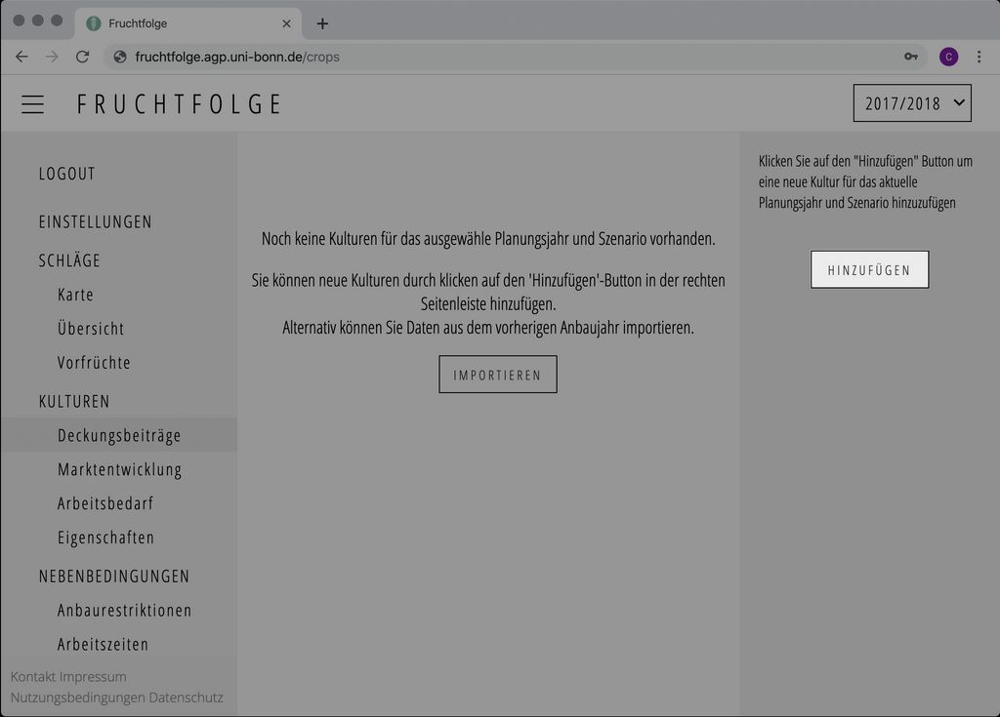
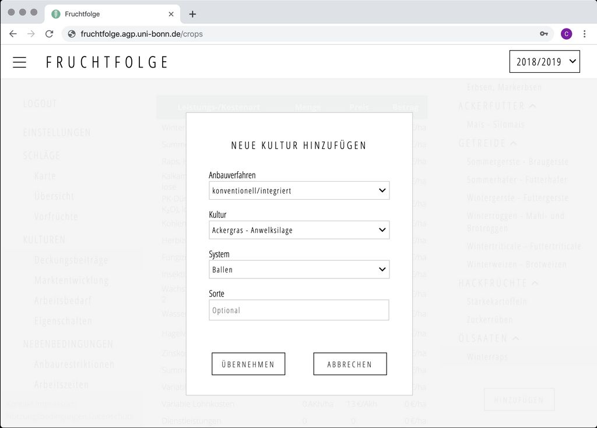

## Übersicht
Auf den Unterseiten des Themas [`Kulturen`](https://fruchtfolge.agp.uni-bonn.de/crops) erhalten Sie eine Übersicht über alle im aktuellen Planungsjahr ausgewählten Kulturen. Die Kulturen stellen gleichzeitig alle möglichen Anbauoptionen in der späteren Optimierung dar.

Auf allen Unterseiten des Themas 'Kulturen' werden die aktuell ausgewählten Kulturen in einer Seitenleiste auf der rechten Seite der Programmoberfläche angezeigt. Die Kulturen werden für eine bessere Übersicht nach ihrer Zugehörigkeit nach Kulturgruppen unterteilt. Ein klick auf den Namen einer Kultur wählt diese Kultur aus, und lädt die dazugehörigen Werte in das aktuell geöffnete Programmfenster.

<video id="crops_overview" width="100%" height="auto" controls autoplay loop>
  <source src="../img/crops_overview.webm" type="video/webm">
  <source src="../img/crops_overview.mp4" type="video/mp4">
  Ihr Browser kann dieses Video nicht abspielen.
</video> 

## Kultur hinzufügen
Wechseln Sie zur Seite [`Deckungsbeiträge`](https://fruchtfolge.agp.uni-bonn.de/crops).
Klicken Sie in der rechten Seitenleiste auf den Button mit der Aufschrift 'Hinzufügen'.

Es öffnet sich ein Eingabefenster. Über die Angabe des Anbauverfahrens (konventionell/ökologisch), des Kulturnamens sowie des Anbausystems (z.B. wendend/nicht wendend) kann die Kultur spezifiziert werden. Wenn Sie mehrere Sorten einer Kultur hinzufügen möchten, können Sie Optional einen Sortennamen angeben.

Durch Klicken des **Übernehmen**-Buttons wird die Kultur gespeichert. Im Hintergrund werden nun automatisch die Deckungsbeitrags-, Arbeitszeit-, Dünge-, und Fruchtfolgedaten abgefragt.

Über den **Abbrechen**-Button können Sie den Vorgang abbrechen.

## Kultur bearbeiten

### Deckungsbeitrag
Wechseln Sie zur Seite [`Deckungsbeiträge`](https://fruchtfolge.agp.uni-bonn.de/crops). Wählen Sie in der rechten Seitenleiste der Programmoberfläche die gewünschte Kultur aus. 

Um einen Eintrag in der Deckungsbeitragskalkulation anzupassen, klicken Sie in die Zelle die Sie verändern möchten, und geben Sie den gewünschten Wert ein. Der Wert wird automatisch gespeichert, sobald Sie außerhalb der Zelle klicken.

::: tip Punkt statt Komma 
Bei der Eingabe von Zahlen muss das Komma durch einen Punkt ersetzt werden.
:::

<video id="change_gm" width="100%" height="auto" controls autoplay loop>
  <source src="../img/change_gm.webm" type="video/webm">
  <source src="../img/change_gm.mp4" type="video/mp4">
  Ihr Browser kann dieses Video nicht abspielen.
</video> 

::: warning Betrag lässt sich nicht verändern
Die Werte in der Spalte 'Betrag' ergeben sich aus der Summe der Werte aus den Spalten 'Preis' und 'Menge'. Um den Betrag zu verändern, müssen Sie somit entweder den Preis oder die Menge anpassen. In den variablen Maschinenkosten sind standardmäßig Menge und Preis `0`, jedoch wird trotzdem ein Betrag angezeigt. Um diesen nun anzupassen, geben Sie unter 'Menge' den Wert `1` und unter 'Preis' die tatsächlichen Maschinenkosten an (z.B. `420`).
:::

### Marktentwicklung

### Arbeitszeitbedarf

### Wirkung auf Nachfrüchte

### Anbaupause, Greening-Faktor, etc.

### Düngeverordnung

## Kultur löschen
Wechseln Sie zur Seite [`Deckungsbeiträge`](https://fruchtfolge.agp.uni-bonn.de/crops). Wählen Sie die zu löschende Kultur in der rechten Seitenleiste aus. Scrollen Sie in der Programmoberfläche an das untere Ende der Deckungsbeitragstablle. Klicken Sie dort auf den Button mit der Aufschrift 'Entfernen'. Die Kultur wurde nun dauerhaft gelöscht.

<video id="delete_crop" width="100%" height="auto" controls autoplay loop>
  <source src="../img/delete_crop.webm" type="video/webm">
  <source src="../img/delete_crop.mp4" type="video/mp4">
  Ihr Browser kann dieses Video nicht abspielen.
</video> 
