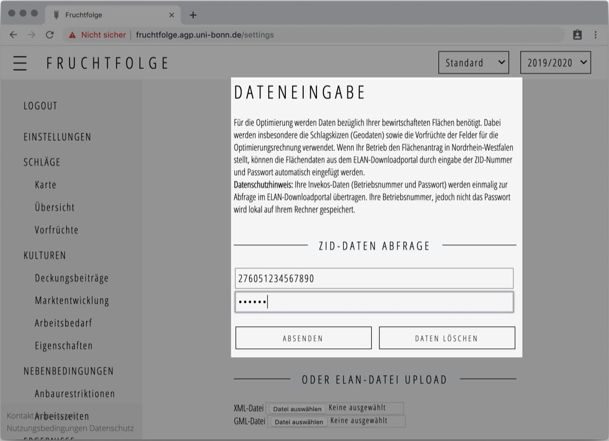
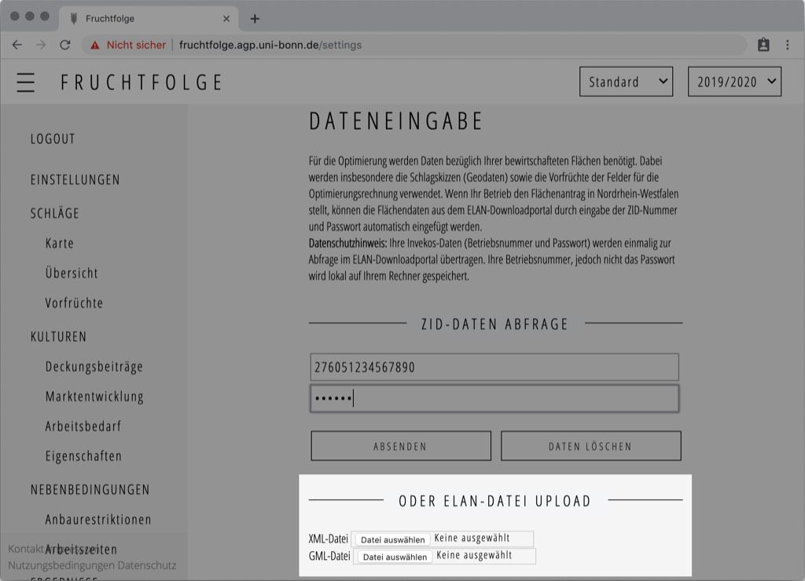
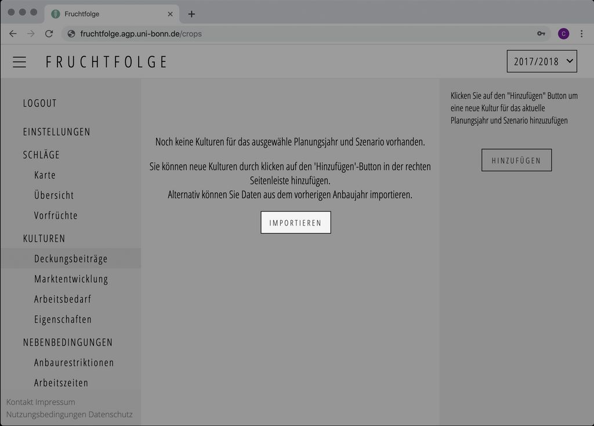

Auf der Seite [`Einstellungen`](https://fruchtfolge.agp.uni-bonn.de/settings) haben Sie die Möglichkeit, Daten über die von Ihnen bewirtschafteten Schläge und Kulturen aus Ihrem Flächenantrag zu importieren.

::: warning Hinweis
Der Import von Flächenantragsdaten ist aus technischen Gründen aktuell nur für **Nordrhein-Westfalen** verfügbar. Sie können die Anwendung jedoch auch verwenden, wenn Ihr Betrieb den Flächenantrag in einem anderen Bundesland stellt. In diesem Fall [übersprigen Sie dieses Kapitel](./crops.html#kultur-hinzufugen).
:::

## Automatischer Import <Badge text="empfohlen"/>

Um die Daten automatisch aus dem Flächenantrag zu importieren, geben Sie Ihre **15-Stellige ZID Betriebsnummer** in das Eingabefeld mit dem Platzhalter *ZID-Betriebsnummer (27605...)* ein. Anschließend füllen Sie das Feld mit dem Platzhalter *Passwort* mit der zur ZID-Betriebsnummer gehörigen **6-Stelligen ZID-Pin** aus.

Drücken Sie nun auf die Schaltfläche **Absenden**. Die Daten werden automatisch vom [LWK-Downloadportal](https://www.lwk-verfahren.de/DownloadPortal/pages/loadPage.action) heruntergeladen und in die Fruchtfolge anwendung importiert.

::: danger Netzwerkfehler
In manchen Fällen schlägt der automatische Import fehl.
Überprüfen Sie in diesen fällen bitte die folgenden Dinge:
1. Sind Betriebsnummer und PIN korrekt ausgefüllt?
2. Lässt sich das [LWK-Downloadportal](https://www.lwk-verfahren.de/DownloadPortal/pages/loadPage.action) von Ihrem Gerät erreichen?
3. Wurde die Internetverbindung von Ihrem Gerät zurückgesetzt?

Wenn Sie diese Dinge überprüft haben, können Sie nach kurzer Zeit wiederholt auf die **Absenden** Schaltfläche drücken. Falls der Fehler bestehen bleibt, wären wir über eine [kurze Mitteilung](mailto:fruchtfolge@uni-bonn.de) dankbar! 
:::

## Manueller Import
Der manuelle Import von Flächenatragsdaten ist insbesondere für den Zeitraum zwischen der Antragsstellung im Frühjahr und der Bereitstellung der Daten im LWK-Downloadportal zum 01.09 des Jahres geeignet. Gleichtzeitig können Sie den manuellen Import nutzen, wenn Sie Ihre ZID-Betriebsnummer und PIN nicht angeben möchten.

Die erforderlichen `.xml` und `.gml` Dateien für die vergangenen Antragsjahre können Sie dabei aus dem [LWK-Downloadportal](https://www.lwk-verfahren.de/DownloadPortal/pages/loadPage.action) beziehen. Eine Anleitung zur Benutzung des Downloadportal finden Sie auf den [Seiten der Landwirtschaftskammer-NRW](https://www.landwirtschaftskammer.de/foerderung/elan/faq-downloadportal.htm)

Den Flächenantrag für das aktuelle Antragsjahr (zwischen Antragsstellung und 01.09 des Jahres) können Sie direkt aus dem Antragsprogramm [ELAN-NRW](https://www.elan-nrw.de/webClient_NW/) herunterladen. Eine detaillierte Anleitung für den Export findet beispielsweise auf der [Website von topfarmplan](https://www.topfarmplan.de/elan-flaechenantrag-ackerschlagkartei-flaechenimport/#nrw).

Wenn Sie die Antragsdaten heruntergeladen haben, können Sie diese nun importieren.
Klicken Sie dafür zunächst auf den Button **Datei auswählen** neben dem Text *XML-Datei* um das jeweilige Flächenverzeichnis mit der Dateiendung `.xml` hochzuladen. Beachten Sie dabei, dass Sie Daten von jeweils nur einem Antragsjahr gleichzeitig hochladen können.  
Anschließen klicken Sie auf den Button **Datei auswählen** neben dem Text *GML-Datei* um die Schlaggeometrien des jeweiligen Antragsjahr hochzuladen. Wenn Sie beide Dateien ausgewählt haben, beginnt der Import automatisch.

## Übernahme der Daten in das aktuelle Planungsjahr

Nach dem erfolgreichen Import werden die Flächenantragsdaten lediglich für das Jahr der Antragstellung importiert. Beispielsweise werden Ihnen die Flächen und Kulturen des Flächenantrags 2019 ausschließlich im Planungsjahr `2018/2019` angezeigt. Möchten Sie die Flächen und Kulturen für das darauffolgende Planungsjahr importieren, wählen Sie zunächst in der [`Planungsjahrauswahl`](./overview.html#planungsjahrauswahl) das gewünschte Planungsjahr aus (in unserem Beispiel das Planungsjahr `2019/2020`). Wechseln Sie anschließend zur Seite [`Deckungsbeiträge`](https://fruchtfolge.agp.uni-bonn.de/crops). Klicken Sie dort auf den 'Importieren'-Button, um die Vorjahresdaten zu übernehmen.

