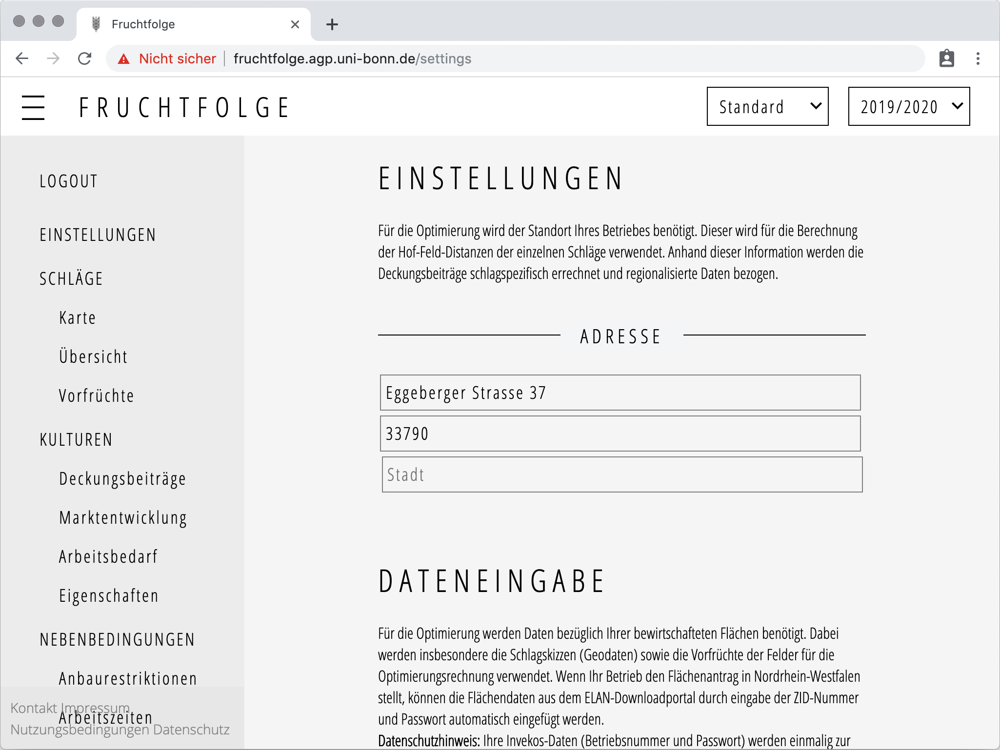
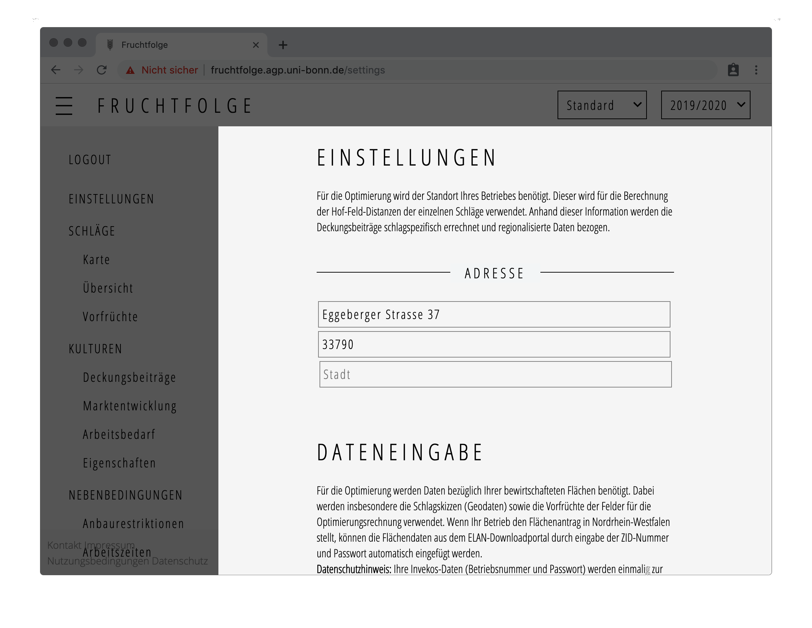
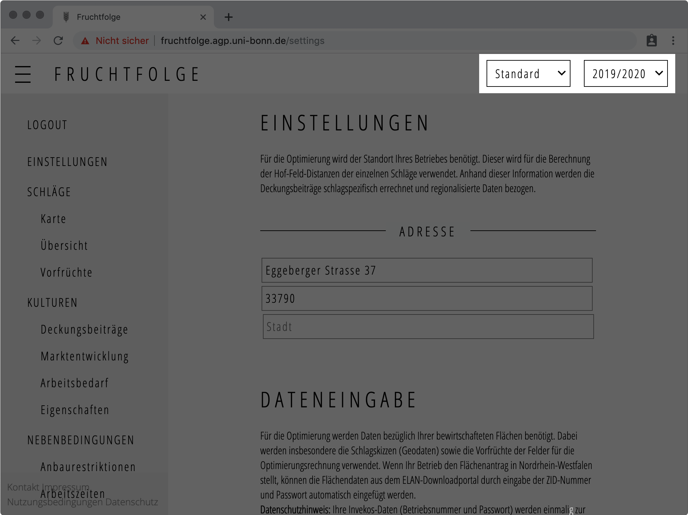

Nach der erfolgreichen Registrierung werden Sie auf die Seite **Einstellungen**
weitergeleitet.

Im folgenden Abschnitt soll jedoch zunächst auf den allgemeinen Programmaufbau eingegangen werden.
Alle Unterseiten der Fruchtfolge Anwendung bestehen grundsätzlich aus den gleichen drei Elementen:
Der [Programmoberfläche](./overview.html#hauptseite), der [Navigationsleiste](./overview.html#navigationsleiste) und der [Szenario- /Wirtschaftsjahrauswahl](./overview.html#szenario-wirtschaftsjahrauswahl).

## Programmoberfläche
Auf der Programmoberfläche wird der Inhalt der Fruchtfolge Anwendung abgebildet.
Abhängig von der ausgewählten Unterseite gibt es in der Oberfläche die Möglichkeit,
Daten an die betrieblichen Gegebenheiten anzupassen. Die Funktionen der einzelnen
Unterseiten werden im Abschnitt [Unterseiten](./overview.html#szenario-wirtschaftsjahrauswahl) erläutert.

## Navigationsleiste
Mit der Navigationsleiste können Sie sich zu den verschiedenen Unterseiten der Anwendung bewegen.
Der oberste Menüpunkt in der Navigationsleiste, **Logout**, meldet Sie dabei von Ihrer aktuellen Sitzung ab.

## Szenario- /Wirtschaftsjahrauswahl
In der oberen rechten Ecke der Anwendung befinden sich zwei Buttons mit der Aufschrift
**Standard** und **2019/2020**. 

Der Button mit der Aufschrift **Standard** bildet
das aktuell ausgewählte Szenario ab. In der aktuellen Programmversion können noch keine
neuen Szenarien hinzugefügt werden. Die Funktion wurde jedoch bereits angelegt, um
in Zukunft beispielsweise für unterschiedliche Preis-/ Ertragserwartungen, auswirkungen
zusätzlicher Pachtflächen uvm. Szenarien zu erstellen und einfach vergleichen
zu können.

Der Button mit der Aufschrift **2019/2020** stellt das aktuell ausgewählte Planungsjahr dar.
Sie können zwischen den Planungsjahren wechseln, um u.a. jahresspezifische Teilschläge,
Vorfrüchte und Deckungsbeiträge einzusehen oder zu verändern.

