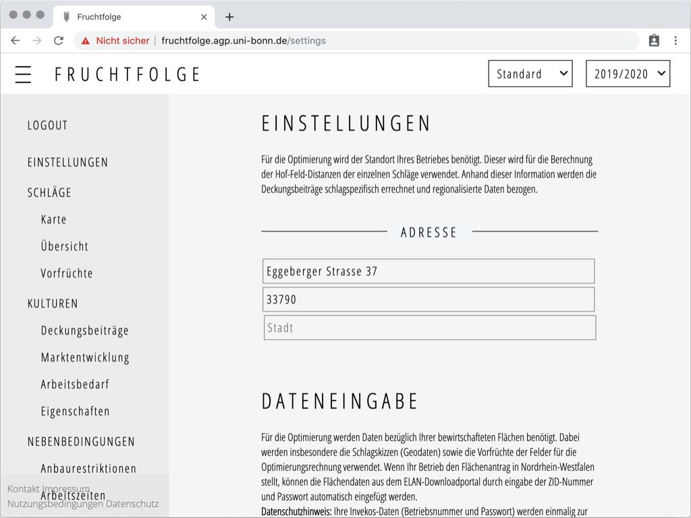
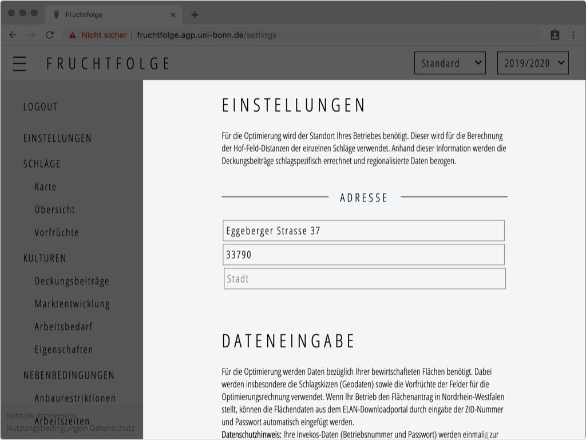
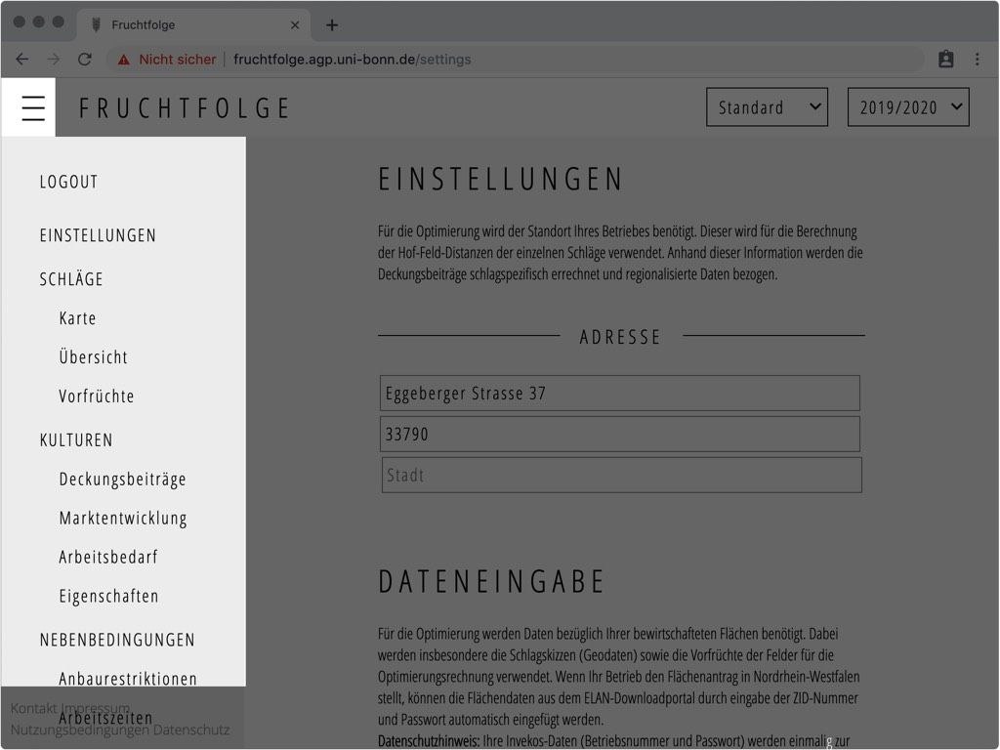
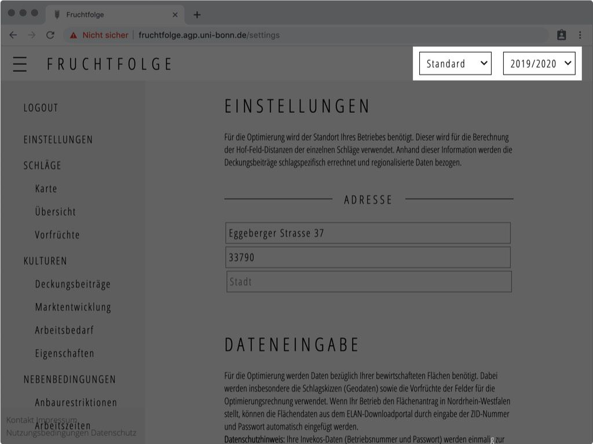

Nach der erfolgreichen Registrierung werden Sie auf die Seite **Einstellungen**
weitergeleitet.

Im folgenden Abschnitt soll jedoch zunächst auf den allgemeinen Programmaufbau eingegangen werden.
Alle Unterseiten der Fruchtfolge Anwendung bestehen grundsätzlich aus den gleichen drei Elementen:
Der [Programmoberfläche](./overview.html#programmoberflache), der [Navigationsleiste](./overview.html#navigationsleiste) und der [Planungsjahrauswahl](./overview.html#planungsjahrauswahl).

## Programmoberfläche
Auf der Programmoberfläche wird der Inhalt der Fruchtfolge Anwendung abgebildet.
Abhängig von der ausgewählten Unterseite gibt es in der Oberfläche die Möglichkeit,
Daten an die betrieblichen Gegebenheiten anzupassen.

## Navigationsleiste
Mit der Navigationsleiste können Sie sich zu den verschiedenen Unterseiten der Anwendung bewegen.  
Durch einen Klick auf das Symbol ☰ in der oberen linken Ecke können Sie die Navigationsleiste ein- und ausblenden.  
Der oberste Menüpunkt in der Navigationsleiste, **Logout**, meldet Sie dabei von Ihrer aktuellen Sitzung ab.

## Planungsjahrauswahl
In der oberen rechten Ecke der Anwendung befinden sich eine Schaltfläche mit der Aufschrift **2019/2020**. 

<!--
Der Button mit der Aufschrift **Standard** bildet
das aktuell ausgewählte Szenario ab. 

::: warning
In der aktuellen Programmversion können noch keine
neuen Szenarien hinzugefügt werden. Die Funktion wurde jedoch bereits angelegt, um
in Zukunft beispielsweise für unterschiedliche Preis-/ Ertragserwartungen, auswirkungen
zusätzlicher Pachtflächen uvm. Szenarien zu erstellen und einfach vergleichen
zu können.
:::
--> 
Der Button stellt das aktuell ausgewählte Planungsjahr dar.
Sie können zwischen den Planungsjahren wechseln, um u.a. jahresspezifische Teilschläge,
Vorfrüchte und Deckungsbeiträge einzusehen oder zu verändern.

