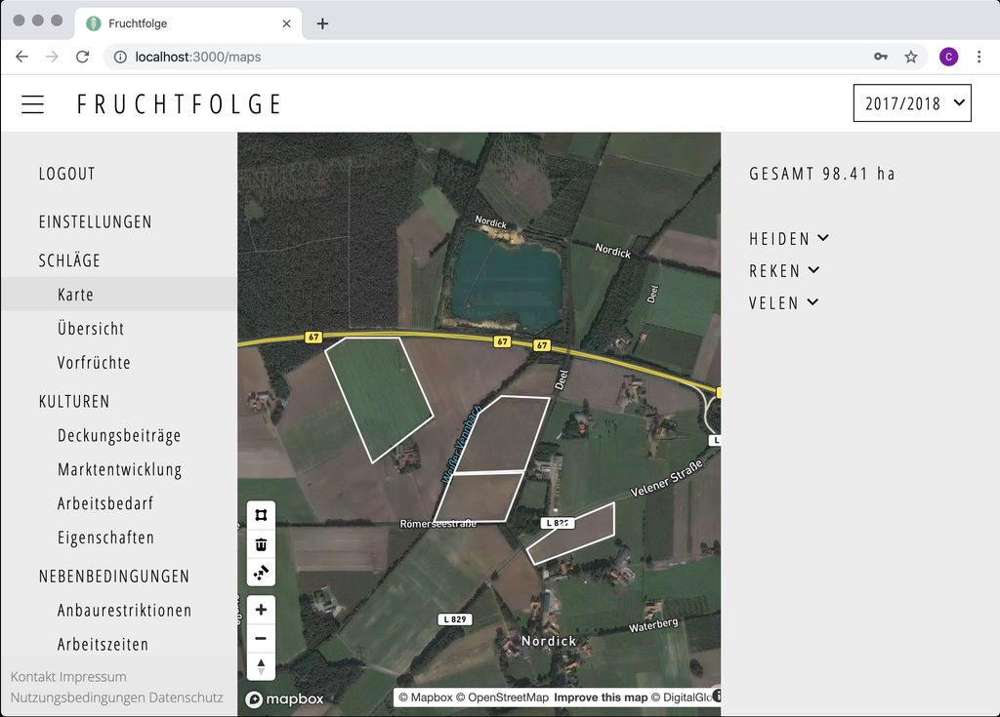

::: tip Tipp 
Wenn Sie keine Flächenantragsdaten importiert haben, sollten Sie die von
Ihnen angebauten Kulturen zuerst hinzufügen ([zur Anleitung](./crops.html#kultur-hinzufugen)). Dadurch wird die eingabe der Vorfrüchte auf
den verschiedenen Schlägen vereinfacht.
:::

## Übersicht

Auf den Unterseiten des Themas [`Schläge`](https://fruchtfolge.agp.uni-bonn.de/maps) erhalten Sie eine Übersicht über all Ihre Schläge.

::: warning Trotz Import werden keine Schläge angezeigt
Die historischen Flächenantragsdaten werden nicht automatisch in das aktuelle Planungsjahr übernommen. Sie können jedoch die Antragsdaten des vorherigen Anbaujahrs importieren ([zur Anleitung](./import.html#ubernahme-der-daten-in-das-aktuelle-planungsjahr)).
:::

In der rechten Hälfte der Kartenansicht befindet sich eine Seiteleiste mit der von Ihnen bewirtschafteten Gesamtfläche und einer Auflistung aller Schläge. 

Die Schläge werden für eine bessere Übersicht automatisch nach Regionen unterteilt. Durch klicken auf den Namen einer Region werden alle der Region zugehörigen Schläge angezeigt. Beim klicken auf eine Schlagbezeichnung 'fliegt' die Kartenansicht zum ausgewählten Schlag.

<video id="plots_main" width="100%" height="auto" controls autoplay loop>
  <source src="../img/plots_main.webm" type="video/webm">
  <source src="../img/plots_main.mp4" type="video/mp4">
  Ihr Browser kann dieses Video nicht abspielen.
</video> 

## Schlag hinzufügen

Wechseln Sie zur Seite [`Karte`](https://fruchtfolge.agp.uni-bonn.de/maps).

In der linken, unteren Ecke der Kartenansicht befindet sich eine Reihe von Symbolen:
Ein Rechteck, ein Papierkorb und ein weiteres Symbol (Zusammenfügen).

Durch den Klick auf das Rechteck-Symbol verändert sich ihr Mauszeiger zu einem Fadenkreuz: Sie können nun beginnen, einen Schlag in der Karte einzuzeichnen:

<!--  -->
<video id="add_plot" width="100%" height="auto" controls autoplay loop>
  <source src="../img/add_plot.webm" type="video/webm">
  <source src="../img/add_plot.mp4" type="video/mp4">
  Ihr Browser kann dieses Video nicht abspielen.
</video> 

Hierzu klicken Sie mit dem Fadenkreuz jeweils in die Ecken des Schlags in der Karte.
Um die Zeichnung abzuschließen, klicken Sie erneut auf die zuerst gezeichnete Koordinate.

::: tip Zeichnung abbrechen 
Wenn Sie die Zeichnung eines Schlags abbrechen möchten, können Sie die **Escape-Taste** (`Esc`) auf Ihrer Tastatur drücken. Anstelle des Fadenkreuzes wird Ihnen nun wieder
der gewöhnliche Mauszeiger angezeigt.
:::

Nachdem Sie die Zeichnung des Schlags abgeschlossen haben, öffnet sich automatisch
ein Eingabefenster. Hier können Sie die Bezeichnung des Schlags, sowie die jeweiligen Vorfrüchte angeben.

Durch Klicken des **Übernehmen**-Buttons wird der Schlag gespeichert. Im Hintergrund werden nun automatisch die Hof-Feld-Distanz, Bodenqualität, Bodenart, der Humusgehalt, sowie die Zugehörigkeit der Fläche zu einem "roten" Grundwasserkörpers  abgefragt.

Über den **Abbrechen**-Button können Sie den Vorgang abbrechen.

## Schlag bearbeiten
### Geometrie
Wechseln Sie zur Seite [`Karte`](https://fruchtfolge.agp.uni-bonn.de/maps). Wählen Sie dort den Schlag durch anklicken in der Kartenansicht zunächst aus. Die zuvor definierten Eckpunkte des Schlags werden nun angezeigt. Die Punkte können nun veschoben werden, indem Sie zunächst einen Punkt anklicken, gedrückt halten und an die gewünschte Position ziehen.
Ihre Änderungen werden automatisch gespeichert.

<video id="change_plot" width="100%" height="auto" controls autoplay loop>
  <source src="../img/change_plot.webm" type="video/webm">
  <source src="../img/change_plot.mp4" type="video/mp4">
  Ihr Browser kann dieses Video nicht abspielen.
</video> 

### Bodenqualität und weitere Eigenschaften
Wechseln Sie zur Seite [`Übersicht`](https://fruchtfolge.agp.uni-bonn.de/overview). 
Klicken Sie in die Zelle die Sie verändern möchten, und geben Sie den gewünschten Wert ein. Der Wert wird automatisch gespeichert, sobald Sie außerhalb der Zelle klicken.

::: tip Punkt statt Komma 
Bei der Eingabe von Zahlen muss das Komma durch einen Punkt ersetzt werden.
:::

<video id="plot_overview" width="100%" height="auto" controls autoplay loop>
  <source src="../img/plot_overview.webm" type="video/webm">
  <source src="../img/plot_overview.mp4" type="video/mp4">
  Ihr Browser kann dieses Video nicht abspielen.
</video> 

### Vorfrüchte

::: warning Keine Kulturen
Sie können die Vorfrüchte Ihrer Schläge erst verändern, wenn Sie bereits Kulturen als mögliche Anbauoptionen hinzugefügt haben ([zur Anleitung](./crops.html#kultur-hinzufugen)).
:::

Wechseln Sie zur Seite [`Vorfrüchte`](https://fruchtfolge.agp.uni-bonn.de/plots-previous-crops). In dieser Ansicht können Sie Vorfrüchte sowie Zwischenfrüchte der vergangenen 3 Anbaujahre angeben. Um eine Vorfrucht für einen Schlag auszuwählen, klicken Sie in der Zeile des Schlags auf das Dropdown-Menü für das gewünschte Anbaujahr. Wählen Sie nun im Dropdown-Menü die Vofrucht für den gewählten Schlag und das gewählte Anbaujahr aus.

<video id="plots_prev_crops" width="100%" height="auto" controls autoplay loop>
  <source src="../img/plots_prev_crops.webm" type="video/webm">
  <source src="../img/plots_prev_crops.mp4" type="video/mp4">
  Ihr Browser kann dieses Video nicht abspielen.
</video> 

::: tip Kulturen mit langer Anbaupause
Die Angabe der Vorfrüchte der letzten 3 Anbaujahre ist lediglich ausreichend für Kulturen mit einer Anbaupause von weniger als 4 Jahren. Falls Sie Kulturen mit einer längeren Anbaupause anbauen (z.B. Vermehrungsraps mit mind. 10 Jahren Anbaupause), müssen Sie weitere Vorfrüchte angeben um die Anbaupausen einzuhalten. Sie können weitere Vorfrüchte angeben, indem Sie schrittweise in der [Planungsjahrauwahl](./overview.html#planungsjahrauswahl) vorherige Wirtschaftsjahre auswählen, und die Vorfrucht-Tabelle entsprechend ergänzen.
:::

## Schlag löschen
Wechseln Sie zur Seite [`Karte`](https://fruchtfolge.agp.uni-bonn.de/maps). Wählen Sie den Schlag durch anklicken in der Kartenansicht zunächst aus. Anschließend klicken Sie auf das **Papierkorb-Symbol** in der linken, unteren Ecke der Kartenansicht. Der Schlag wurde nun dauerhaft gelöscht.

<video id="delete_plot" width="100%" height="auto" controls autoplay loop>
  <source src="../img/delete_plot.webm" type="video/webm">
  <source src="../img/delete_plot.mp4" type="video/mp4">
  Ihr Browser kann dieses Video nicht abspielen.
</video> 
