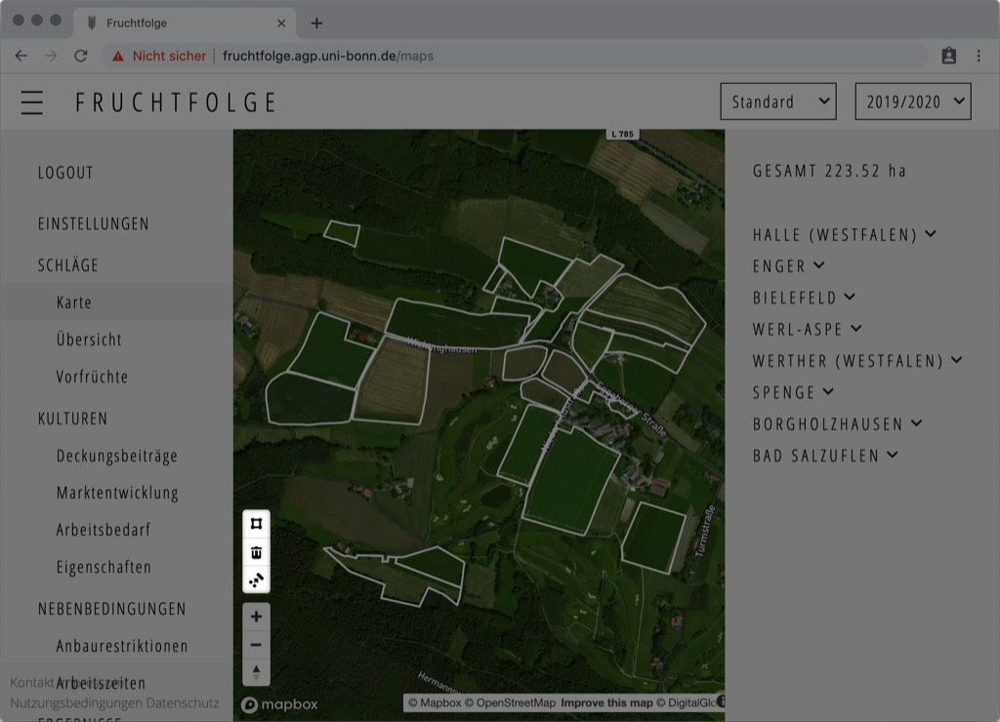
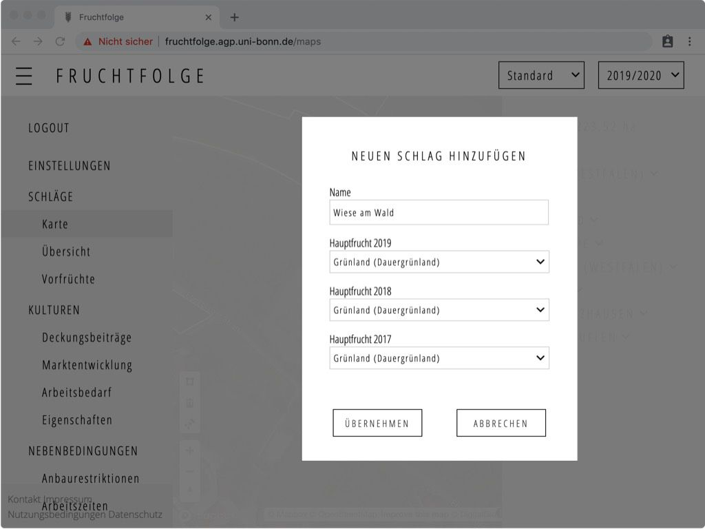

::: tip Tipp 
Wenn Sie keine Flächenantragsdaten importiert haben, sollten Sie zunächst die von
Ihnen angebauten Kulturen hinzufügen. Dadurch wird die eingabe der Vorfrüchte auf
den verschiedenen Schlägen vereinfacht.
:::

## Schlag hinzufügen

Um einen Schlag hinzuzufügen, wechseln Sie zur nächst zur Seite [`Karte`](http://fruchtfolge.agp.uni-bonn.de/maps).

In der linken, unteren Ecke der Kartenansicht befindet sich eine Reihe von Symbolen:
Ein Rechteck, ein Papierkorb und ein weiteres Symbol (Zusammenfügen).

Durch den Klick auf das Rechteck-Symbol verändert sich ihr Mauszeiger zu einem Fadenkreuz: Sie können nun beginnen, einen Schlag in der Karte einzuzeichnen:

<!--  -->
<video id="add_plot" width="100%" height="auto" controls autoplay loop>
  <source src="../img/add_plot.mp4" type="video/mp4">
  Your browser does not support the video tag.
</video> 

Hierzu klicken Sie mit dem Fadenkreuz jeweils in die Ecken des Schlags in der Karte.
Um die Zeichnung abzuschließen, klicken Sie erneut auf die zuerst gezeichnete Koordinate.

::: tip Zeichnung abbrechen 
Wenn Sie die Zeichnung eines Schlags abbrechen möchten, können Sie die **Escape-Taste** (`Esc`) auf Ihrer Tastatur drücken. Anstelle des Fadenkreuzes wird Ihnen nun wieder
der gewöhnliche Mauszeiger angezeigt.
:::

Nachdem Sie die Zeichnung des Schlags abgeschlossen haben, öffnet sich automatisch
ein Eingabefenster. Hier können Sie die Bezeichnung des Schlags, sowie die jeweiligen Vorfrüchte angeben.

Durch Klicken des **Übernehmen**-Buttons wird der Schlag gespeichert. Im Hintergrund werden nun automatisch die Hof-Feld-Distanz, Bodenqualität, Bodenart, der Humusgehalt, sowie ob die Fläche innerhalb eines "roten" Grundwasserkörpers liegt abgefragt.

Über den **Abbrechen**-Button können Sie den Vorgang abbrechen.

## Schläge bearbeiten
### Geometrie
Um die Geometrie eines Schlags zu verändern, wählen Sie den Schlag durch anklicken in der Kartenansicht zunächst aus. Die zuvor definierten Eckpunkte des Schlags werden nun angezeigt. Die Punkte können nun veschoben werden, indem Sie zunächst einen Punkt anklicken, gedrückt halten und an die gewünschte Position ziehen.
Ihre Änderungen werden automatisch gespeichert.

### Bodenqualität und weitere Eigenschaften
Um Schlageigenschaften wie Bodenqualität, Bodenart, Humusgehalt, etc. zu bearbeiten,
wechseln Sie zunächst zur Ansicht [`Übersicht`](http://fruchtfolge.agp.uni-bonn.de/overview). 

### Vorfrüchte

### Löschen
Um einen Schlag zu löschen, wählen Sie ihn durch anklicken in der Kartenansicht zunächst aus. Anschließend klicken Sie auf das **Papierkorb-Symbol** in der linken, unteren Ecke der Kartenansicht. Der Schlag wurde nun dauerhaft gelöscht.
